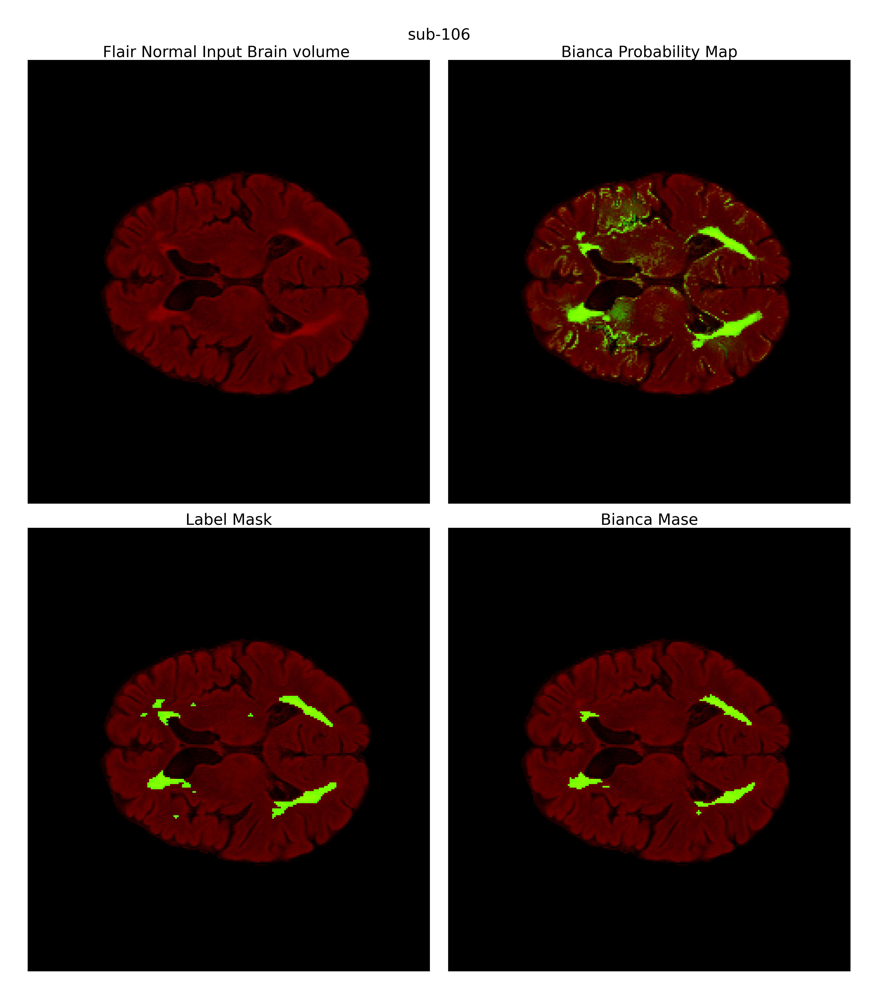

# Bianca Python

Bianca is a tool developed by the FMRIB Image 
Analysis Group at the University of Oxford for performing brain image analysis tasks.
It provides a range of functionalities for processing and analyzing brain image data, including data cleaning,
feature engineering, statistical analysis, and visualization.

https://fsl.fmrib.ox.ac.uk/fsl/fslwiki/BIANCA





```bash

git clone https://github.com/mendeltem/BiancaPython.git

cd BiancaPython
pip install -r requirements.txt
```
Set up to .bashrc
'''

BIANCAPATH=path/to/BiancaPython
PATH=${BIANCAPATH}:${PATH}
'''

Usage

Here's an example of how you can use Bianca_python for brain image analysis:


# BiancaPython

BiancaPython is a software tool for brain image analysis. It provides functionality for processing brain images and performing various analyses.

## Example Usage

You can use BiancaPython to perform brain image analysis with a command-line script. Here's an example command:

```bash
run_bianca -image=tests/data_test/flair_image_bet.nii.gz -mni=tests/data_test/flair_to_mni.mat -masterfile=tests/data_test/Masterfiles/small_masterfile.txt -output="/home/temuuleu/bianca_output.nii"

```

This command runs the BIANCA analysis on the specified input brain image file in NIfTI format (-image),
 using the provided transformation matrix file (-mni) to map the image to MNI space.
The masterfile (-masterfile) contains the configuration and parameters for the analysis.
The results of the analysis will be saved as a NIfTI image with the file path and name specified in the -output argument.


## Options

The following options can be used with the BIANCA shell script:

- `-image=<value>`: Path to the input image in NIfTI format. Required.
- `-mni=<value>`: Path to the MNI template image in NIfTI format. Required.
- `-masterfile=<value>`: Path to the masterfile containing configuration for BIANCA. Required.
- `-output=<value>`: Path to the output directory for BIANCA results. Required.
- `-h`, `-help`: Show this help message and exit.


Please note that the actual usage of Bianca_python may require additional parameters and settings depending on the specific analysis being performed. 
It's recommended to refer to the BIANCA User Guide or consult with the developers for more detailed instructions on how to use the tool effectively.


For more details on the functionalities offered by Bianca_python, you can refer to the BIANCA User Guide or the examples provided in the repository.
Contributing

If you would like to contribute to BiancaPython, please submit a pull request with your changes. We welcome contributions from the community and appreciate your help in making the library better.
License

BiancaPython is released under the * License. See LICENSE for more information.
Contact

If you have any questions or feedback, you can reach us at uchralt.temuulen@charite.de

Thank you for using BiancaPython! We hope you find it useful for your brain image processing and analysis tasks.


